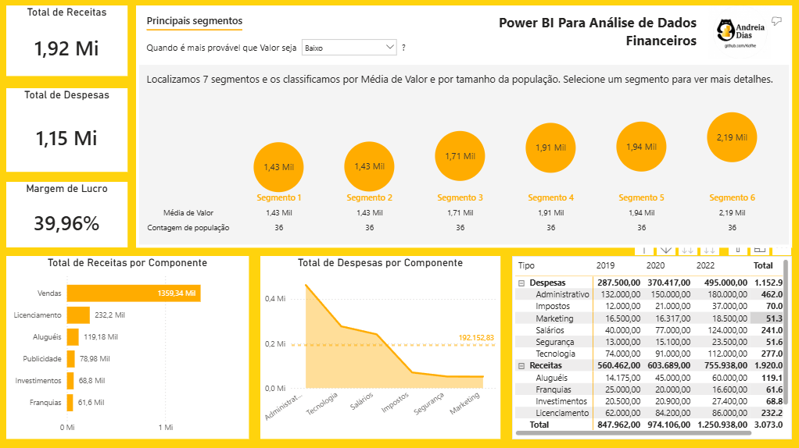

# 💰 Power BI Para Análise de Dados Financeiros

> Dashboard desenvolvido durante meus estudos de Power BI para análise de receitas, despesas e indicadores financeiros.

---

## 📊 Sobre o Projeto

Este projeto foi desenvolvido como parte dos meus estudos em **Power BI**, com foco na análise de dados financeiros e na construção de indicadores para acompanhamento do desempenho da empresa.

O dashboard apresenta uma visão geral de **receitas, despesas, margem de lucro e principais segmentos financeiros**.

Neste projeto, explorei o uso do **amarelo como cor de destaque na composição visual do dashboard**.

---

## 📌 Principais Indicadores

| Indicador | Resultado |
|---|---:|
| 💵 Total de Receitas | **1,92 Mi** |
| 💸 Total de Despesas | **1,15 Mi** |
| 📈 Margem de Lucro | **39,96%** |

---

## 📈 Análises Desenvolvidas

🔹 **Receitas**
- Total de Receitas por Componente

🔹 **Despesas**
- Total de Despesas por Componente
- Linha Média das Despesas

🔹 **Análise Financeira**
- Principais Segmentos
- Tabela de Sumário Financeiro
- Indicadores Financeiros

---

## 🛠️ Ferramentas

  
  
  

---

## 🧠 Conceitos Praticados

- Transformação e tratamento de dados no Power Query;
- Pivot e Unpivot de tabelas;
- Criação de hierarquia de datas;
- Criação de tabela de medidas;
- Desenvolvimento de indicadores utilizando DAX;
- Modelagem de dados;
- Construção de dashboards interativos.

---

## 🖼️ Dashboard

  

---

📌 **Projeto desenvolvido para fins de estudo e aprimoramento em Análise de Dados e Power BI.**
